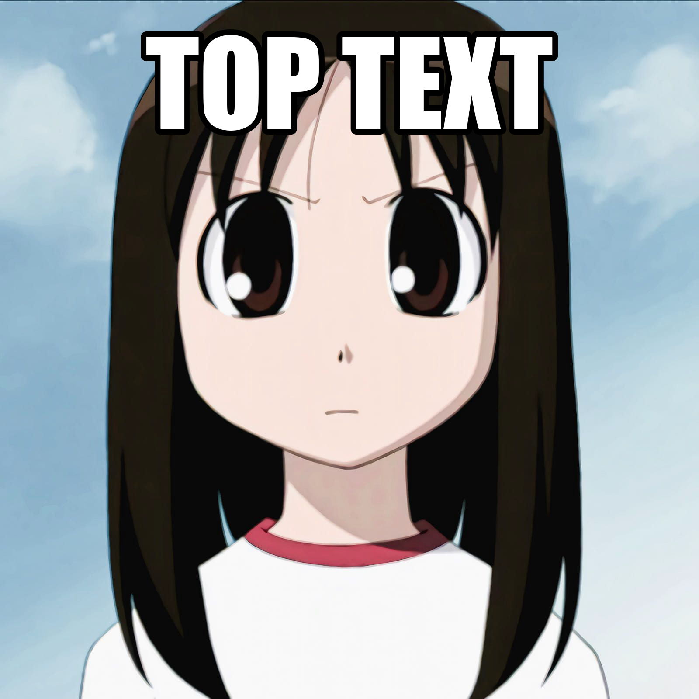
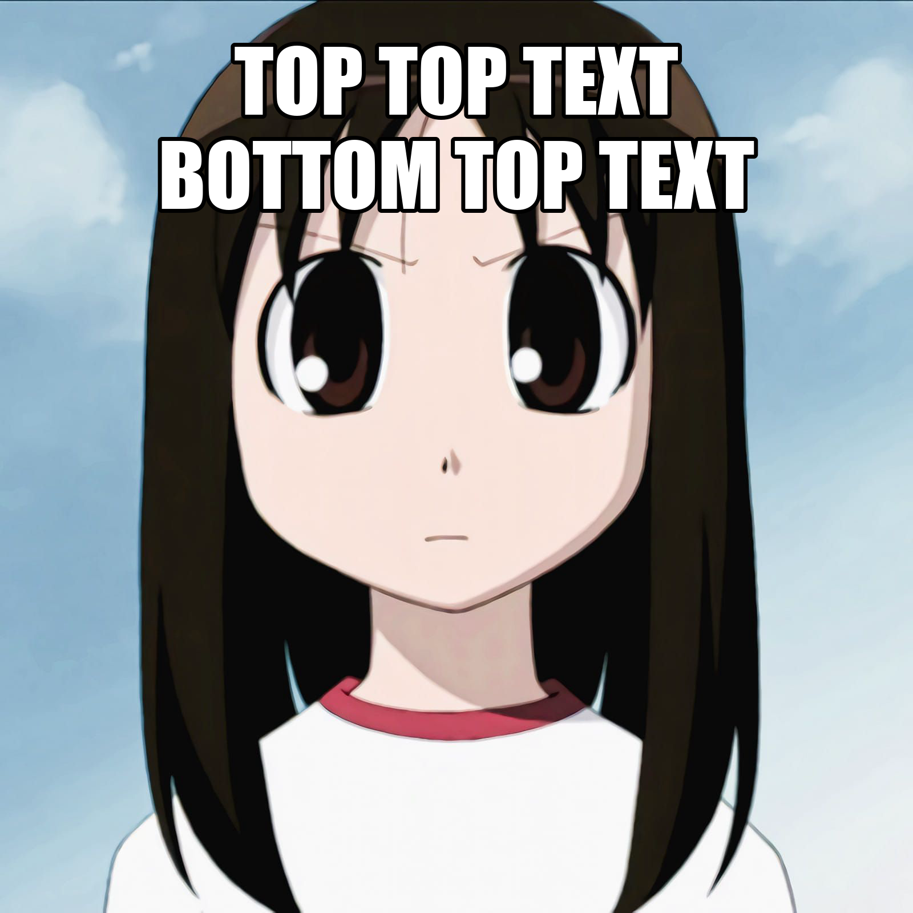
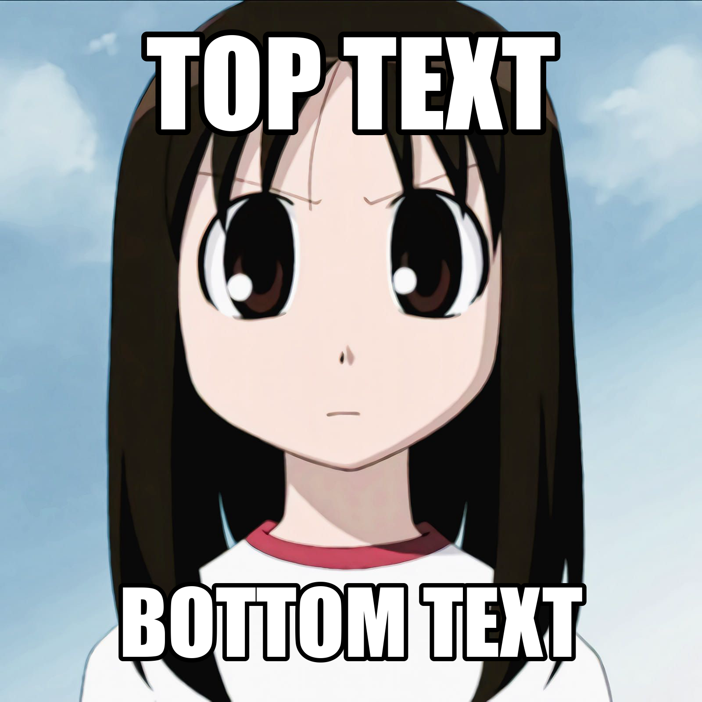
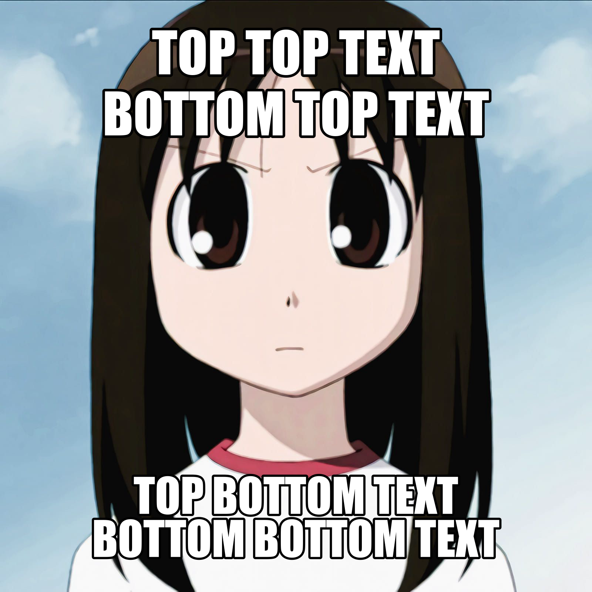
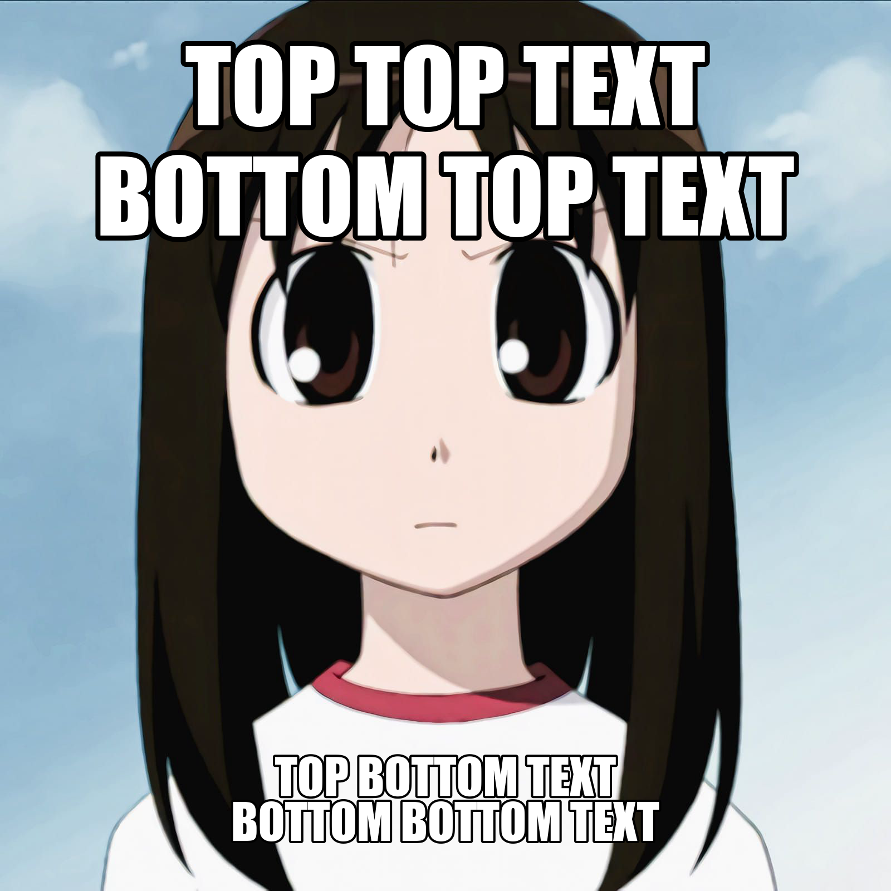
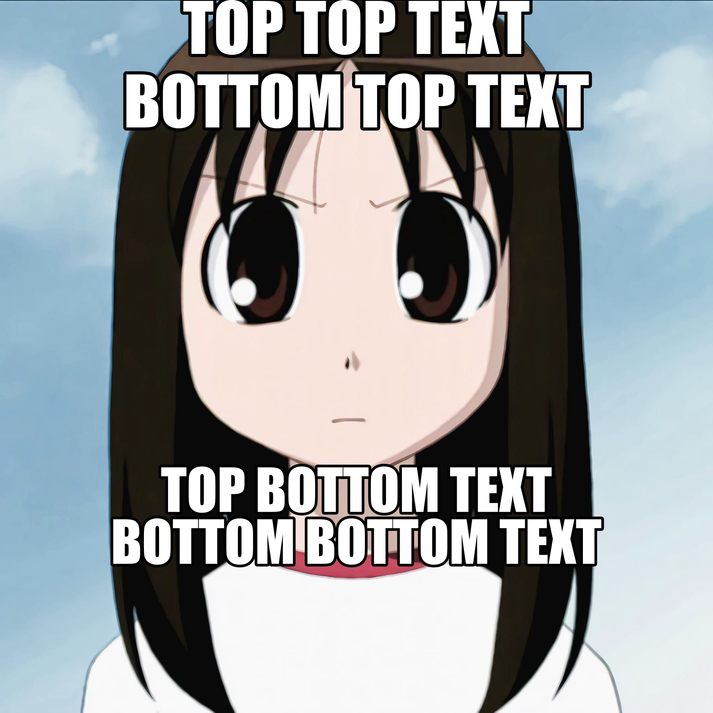

# FFmemepeg
Shitpost FFmpeg-powered command line tool

# Requirements
FFmemepeg requires FFmpeg, bc and Impact font.

# Examples
Example assets can be found in `example/` directory.


```sh
./ffmemepeg -t "TOP TEXT" -b "BOTTOM TEXT" -i example/osaka.png
```


FFmemepeg can also manipulate GIFes and videos.


```sh
./ffmemepeg -t "TOP TEXT" -b "BOTTOM TEXT" -i example/konata.gif
```


# Usage

Print help message using `-h` option.
```sh
$ ./ffmemepeg -h
ffmemepeg [OPTION]... -i INPUT

Options:
    -t, --top               Top text
    -b, --bot               Bottom text
    -o, --output            Output path
    -i, --input             Input path
    -M, --top-margin        Top margin
    -m, --bottom-margin     Bottom margin
    -S, --top-scale         Top text fontsize scale
    -s, --bottom-scale      Bottom text fontsize scale
    -h, --help              Display this help and exit
    -d, --debug             Show debug info
```

The text, putting on image is splitted on two blocks: top text and bottom text.
To add line to top block, use `-t` option.

```sh
./ffmemepeg -i example/osaka.png -t "TOP TEXT"
```



Several lines of text can be added.

```sh
./ffmemepeg -i example/osaka.png -t "TOP TOP TEXT" -t "BOTTOM TOP TEXT"
```



For bottom text, use `-b` option.

```sh
./ffmemepeg -i example/osaka.png -t "TOP TEXT" -b "BOTTOM TEXT"
```



Top and bottom blocks have their own font sizes and margins.
```sh
./ffmemepeg -i example/osaka.png -t "TOP TOP TEXT" -t "BOTTOM TOP TEXT" -b "TOP BOTTOM TEXT" -b "BOTTOM BOTTOM TEXT"
```



Font size can be changed using `-S` option for top block and `-s` for bottom. The font of whole block will be changed.
The argument of size option is a reliative increase ratio: passing `-S 1.2` and `-s 0.7` options means increasing top block
font size by 20% and decreasing bottom block font size by 30%
```sh
./ffmemepeg -i example/osaka.png -t "TOP TOP TEXT" -t "BOTTOM TOP TEXT" -b "TOP BOTTOM TEXT" -b "BOTTOM BOTTOM TEXT" -S 1.2 -s 0.7
```



Blocks also have margins. They can be changed using `-M` and `-m` options. Their size is measured
reliative to image height. The default margins are 0.05 for both top and bottom blocks.
```sh
./ffmemepeg -i example/osaka.png -t "TOP TOP TEXT" -t "BOTTOM TOP TEXT" -b "TOP BOTTOM TEXT" -b "BOTTOM BOTTOM TEXT" -M 0 -m 0.2
```



The output file can be provided with `-o` option. The default output filename is `out` with
input file extention.
