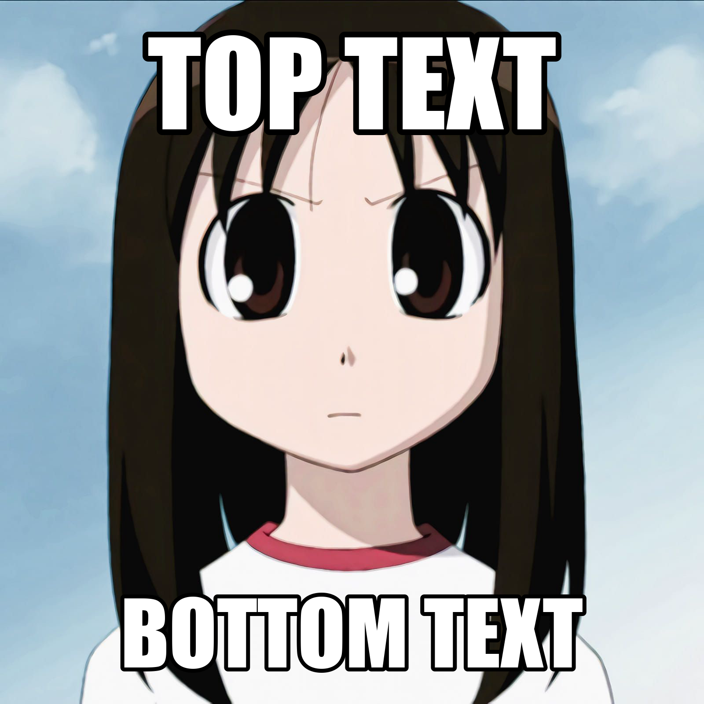
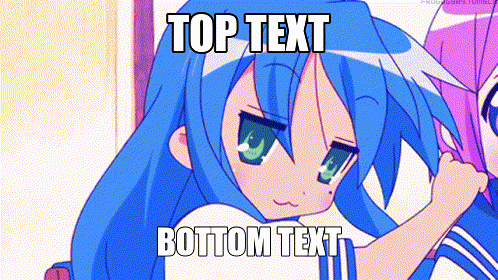

# FFmemepeg
A FFmpeg-powered command line tool to create memes.

# Requirements
FFmemepeg requires FFmpeg and Impact font.

# Usage
```sh
$ ./ffmemepeg.sh -h
ffmemepeg.sh [OPTION]... -i INPUT

Options:
    -h, --help              Display this help and exit
    -t, --top string        Top text
    -b, --bot string        Bottom text
    -o, --output path       Output path
    -i, --input path        Input path
    -M, --top-margin        Top margin
    -m, --bottom-margin     Top margin
    -d, --debug             Show debug information
```

# Examples
Example assets can be found in `example/` directory.


```sh
./ffmemepeg.sh -i example/osaka.png -t "TOP TEXT" -b "BOTTOM TEXT"
```



FFmemepeg can also manipulate GIFes and videos


```sh
./ffmemepeg.sh -i example/konata.gif -t "TOP TEXT" -b "BOTTOM TEXT"
```


